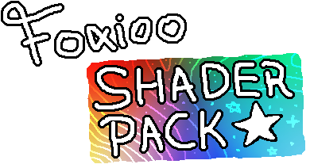

   
   
     
     
   <b>Here is a package of shaders created or modified by me for the Clickteam Fusion!</b> 
   <a href="https://github.com/FoxiooOfficial/FoxiooShaderPack/issues">Report Bug</a>

___

🥳 The package currently has over **+90 Shaders** 🎉

❗ **Shaders currently only work on Windows under Direct3D 9 and Direct3D 11 (No pre-multiplied)**

❗ **Final colors in Direct3D 9 and Direct3D 11 may vary. This is most likely due to the different calculation methods however, I am not completely sure about this.**

## 💿 Installation

1. Click on the **"Code"** button then **"Download ZIP"**.
- 
2. Open Clickteam Fusion, go to the **"Tools"** tab and click **"Windows Explorer"**. **This will show you a window where Clickteam Fusion is installed.**
- 
3. When the window where Clickteam Fusion is installed shows up, **open the ZIP file you downloaded before and in this ZIP file go to the "FoxiooShaderPack-main" folder.** In this folder, **copy the "Foxioo Shader Pack" folder and paste it in the "Effects" folder where Clickteam Fusion is installed.**
- 

## ⚙️ Configuration

1. After the installation process, go to the **"Workspace Toolbar"** window, **select your application** and click **"Properties"**.
- 
2. Go to **"Runtime options"** and make sure **"Display Mode"** is set to **"Direct3D 11"** or **"Direct3D 9"**.
   
- 
   - ⚠️ **If you have "Direct3D 11" set, UNCHECK "Pre-multiplied alpha"**. *Shaders do not have their pre-multiplied version* ***yet!***
   - 

## 📚 Usage

1. Select any object on which the shader can be located and in the **"Display Options"** tab where **"Effect"** is, click on the **"Edit"** button.
- 
2. In the directory tree, select **"Foxioo Shader Pack."** There, select the shader you want to use and click "OK".
- 

## 🖼️ Shader preview

Here are demonstration images of what the shader looks like

### 🚫 Without any effect
- Preview objects along with the background without any effects
- 
- Previewing the background itself
- 

### 🖼️ Addition (Background) ⭐
- .png?raw=true)

### 🖼️ Division (Background) ⭐
- .png?raw=true)

### 🖼️ Addition With Arccosinus (Background) ⭐
- .png?raw=true)

### 🖼️ Inverted (Background) ⭐
- .png?raw=true)

### 🖼️ Multiplication (Background) ⭐
- .png?raw=true)

### 🖼️ Offset Color (Background) ⭐
- .png?raw=true)

