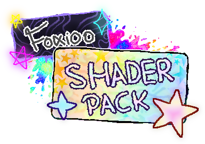

   
   
     
     
   <b>Here is a package of shaders created or modified by me for the Clickteam Fusion!</b> 
   <a href="https://github.com/FoxiooOfficial/FoxiooShaderPack/issues">Report Bug</a>
   |
   <a href="https://github.com/FoxiooOfficial/FoxiooShaderPack/labels/important%20information">Important information</a>
   |
   <a href="https://github.com/FoxiooOfficial/FoxiooShaderPack/blob/main/Table%20of%20shaders.md">List of effects</a>

___

🥳 The package currently has **300 Shaders** 🎉

🗓️ Last updated description dated **September 28, 2025 (UTC+02:00)**

🗓️ Last update of shaders from **September 28, 2024 (UTC+02:00)**

ℹ️ Shaders currently work under:
- D3D9
- D3D11
- D3D11 PRE
- GLES (Android)
- **Support for other platforms coming soon!**
  
### ⚠️‼️‼️ **If you have been using an older version and are updating to the new one, be warned that there may be compatibility issues!** ‼️‼️⚠️

---

## ⭐ Special acknowledgments board

| Person(s)                                                  | Description of how they helped me                                                      |
|------------------------------------------------------------|----------------------------------------------------------------------------------------|
| <a href="https://github.com/NaitorStudios">NaitorStudios</a>                                              | Help in explaining how to rewrite shaders for DX3D11 to DX3D11 Premultiplied.          |
| <a href="https://linktr.ee/just_andrimal">Andrimal</a>                                                   | He composed the music for the trailer.                                                 |
| [Acerola](https://www.youtube.com/@Acerola_t)                                                    | Explanation in videos of how shaders work.                                             |
| [KYwoo](https://linktr.ee/KYwoo.socialss)                                                      | She helps create the Mangaish shader.                                                             |
| Cazra                                                      | He created/modified/participated in the creation of some of the shaders that I modify. |
| [fnkycoldmadeanr](https://github.com/fnkycoldmadeanr)                                            | He created/modified/participated in the creation of some of the shaders that I modify. |
| [Looki](https://community.clickteam.com/user/5742-looki/)                                                      | He created/modified/participated in the creation of some of the shaders that I modify. |
| [gsueberland, JargeZ, r9m89git, SergeyMC9730, zhuker, constanton](https://github.com/JargeZ/ntscqt) | They created the ntscqt project, which helped me make the VHS shader.                  |
| [Toby Fox](https://x.com/tobyfox)                                                   | He created several effects for his game, which I recreated.                            |
| [Daniel Ilett](https://www.youtube.com/dilett07)                                               | He explained how to make a Minecraft Glint shader.                                     |
| [Adam Hawker (aka Sketchy / MuddyMole)](https://community.clickteam.com/user/7947-muddymole/)                      | He created/modified/participated in the creation of some of the shaders that I modify. |
| [Clickteam](https://www.youtube.com/@ClickteamLLC)                                                  | For creating the Fusion 2.5 engine.                                                    |
| [gsuberland](https://forums.getpaint.net/topic/30276-glitch-effect-plugin-polyglitch-v14b/)                                                 | He created the "Codebook" effect, which I recreated.                                   |
| [The Cherno](https://www.youtube.com/@TheCherno)                                                 | He explained how Unity Bloom works, which I recreated.                                 |
| [EriNixie](https://godotshaders.com/shader/actionlines-comic-anime/)                                                   | He created the "Actionlines Comic – Anime" effect, which I recreated.                  |
| [MaPePeR](https://github.com/MaPePeR/jsColorblindSimulator)                                                    | He created the “jsColorblindSimulator” project, which helped me port several shaders.  |
| [小二今天吃啥啊](https://space.bilibili.com/437528440)                                              | He created a shader that mimics the skin of characters from the game Genshin Impact.   |

---

## 🌸 Shader types

| Type                                  | Description                                                                                                                          |
|---------------------------------------|--------------------------------------------------------------------------------------------------------------------------------------|
| Background                            | These shaders use the object texture **AND** the background texture for calculations.                                                |
| Switch                                | These shaders use either the object texture **OR** the background texture depending on the setting of the `_Blending_Mode` variable. |
| Texture                               | These shaders use **ONLY** the object texture                                                                                        |
| Texture+Background/Background+Texture | **Mix** of Background and Switch types                                                                                               |

---

## 💿 Installation

1. Click on the **"Code"** button then **"Download ZIP"**.
- 
2. Open Clickteam Fusion, go to the **"Tools"** tab and click **"Windows Explorer"**. **This will show you a window where Clickteam Fusion is installed.**
- 
3. When the window where Clickteam Fusion is installed shows up, **open the ZIP file you downloaded before and in this ZIP file go to the "FoxiooShaderPack-main" folder.** In this folder, **copy the "Foxioo Shader Pack" folder and paste it in the "Effects" folder where Clickteam Fusion is installed.**
- 

## ⚙️ Configuration

1. After the installation process, go to the **"Workspace Toolbar"** window, **select your application** and click **"Properties"**.
- 
2. Go to **"Runtime options"** and make sure **"Display Mode"** is set to **"Direct3D 11"** or **"Direct3D 9"**.
   
- 

## 📚 Usage

1. Select any object on which the shader can be located and in the **"Display Options"** tab where **"Effect"** is, click on the **"Edit"** button.
- 
2. In the directory tree, select **"Foxioo Shader Pack."** There, select the shader you want to use and click "OK".
- 
