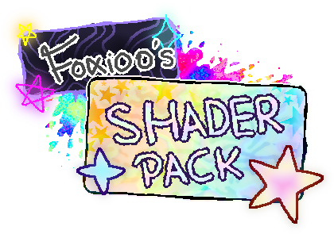

   
   
     
     
   <b>Here is a package of shaders created or modified by me for the Clickteam Fusion!</b> 
   <a href="https://github.com/FoxiooOfficial/FoxiooShaderPack/issues">Report Bug</a>
   |
   <a href="https://github.com/FoxiooOfficial/FoxiooShaderPack/labels/important%20information">Important information</a>
   |
   <a href="https://github.com/FoxiooOfficial/FoxiooShaderPack/blob/main/Table%20of%20shaders.md">List of effects</a>
   |
   <a href="https://ko-fi.com/foxioo">Support my work</a>
   |
   <a href="https://github.com/FoxiooOfficial/FoxiooShaderPack/blob/main/LICENSE">LICENSE</a>

---

### ⚠️ Note
- The description was last updated on **January 22, 2026 (CET)**.
- The update of shaders was last updated on **January 22, 2026 (CET)**.
- FSP is licensed under the **MIT license**.

## 📚 What is FSP? 
### Foxioo Shader Pack is one of the largest packs created for Clickteam Fusion, containing a wide variety of effects divided into 5 main categories:
| Category               | Description                                                                                                                                                                          |
|------------------------|--------------------------------------------------------------------------------------------------------------------------------------------------------------------------------------|
| Blend Modes            | Various effects called blending modes that you will find in graphics programs. They use colors from the object's texture and transform them in various ways using background colors. |
| Coloristic             | Effects in this category can manipulate the colors of your object's texture or background. They include colors that can transform hue, brightness, mask color, and similar effects.  |
| Special                | Effects in this category are intended to simulate a given thing or replicate shaders from other games.                                                                               |
| Transformations        | Effects in this category transform texCoords to scale, rotate, and offsets pixels from the texture.                                                                                  |
| Unused or Experimental | Effects that are only for testing purposes.                                                                                                                                          |

### These shaders also have their own types:
| Type                                    | Description                                                                                                                          | Sum |
|-----------------------------------------|--------------------------------------------------------------------------------------------------------------------------------------|-----|
| Background                              | These shaders use the object texture and the background texture for calculations **OR** only background texture.                     | 205 |
| Switch                                  | These shaders use either the object texture **OR** the background texture depending on the setting of the `_Blending_Mode` variable. | 117 |
| Texture                                 | These shaders use **ONLY** the object texture or external texture                                                                    | 50  |
| Texture+Background / Background+Texture | **Mix** of Background and Switch types                                                                                               | 2   |
|                                         | **Number of effects**                                                                                                                | **374** 🎉 |

## ❓ What does FSP support?
| Graphics API / Exporter             | Support? | Note                                                                                                                                                                                                                                         |
|-------------------------------------|----------|----------------------------------------------------------------------------------------------------------------------------------------------------------------------------------------------------------------------------------------------|
| Windows (Direct3D 8)                | 🟨        | *I found a way to make shaders work under Direct3D8, but without additional variables and textures. I will continue experimenting to achieve full compatibility. (I would like D3D9 and D3D8 to be separated...)* |
| Windows (Direct3D 9)                | ✅        | *Some advanced effects are not the same as other games due to Pixel Shader 2 limitations.*                                                                                                                                                  |
| Windows (Direct3D 11)               | ✅        | -                                                                                                                                                                                                                                            |
| Windows (Direct3D 11 Premultiplied) | ✅        | -                                                                                                                                                                                                                                            |
| Android (OpenGL ES)                 | ✅        | -                                                                                                                                                                                                                                            |
| iOS / macOS (OpenGL ES)             | ✅        | *There may be problems for macOS with some effects.*                                                                                                                                                                                         |
| HTML5 (WebGL)                       | ❌        | *Currently HTML5 exporter does not support effects.*                                                                                                                                                                                         |

---

## 😺 Special acknowledgments board
| Person(s)                                                  | Description of how they helped me                                                      |
|------------------------------------------------------------|----------------------------------------------------------------------------------------|
| <a href="https://github.com/NaitorStudios">NaitorStudios</a>                                              | Help in explaining how to rewrite shaders for D3D11 Non-premultiplied Alpha to D3D11 Premultiplied Alpha also shared his knowledge about shaders.          |
| <a href="https://linktr.ee/just_andrimal">Andrimal</a>                                                   | He composed the music for the trailer.                                                 |
| [Acerola](https://www.youtube.com/@Acerola_t)                                                    | Explanation in videos of how shaders work.                                             |
| [KYwoo](https://linktr.ee/KYwoo.socialss)                                                      | She helps create the Mangaish shader.                                                             |
| [Cazra](https://github.com/Cazra)                                                     | She created/modified/participated in the creation of some of the shaders that I modify. |
| [fnkycoldmadeanr](https://github.com/fnkycoldmadeanr)                                            | He created/modified/participated in the creation of some of the shaders that I modify. |
| [Looki](https://community.clickteam.com/user/5742-looki/)                                                      | He created/modified/participated in the creation of some of the shaders that I modify. |
| [gsueberland, JargeZ, r9m89git, SergeyMC9730, zhuker, constanton](https://github.com/JargeZ/ntscqt) | They created the ntscqt project, which helped me make the VHS shader.                  |
| [Toby Fox](https://x.com/tobyfox)                                                   | He created several effects for his game, which I recreated.                            |
| [Daniel Ilett](https://www.youtube.com/dilett07)                                               | He explained how to make a Minecraft Glint shader.                                     |
| [Adam Hawker (aka Sketchy / MuddyMole)](https://community.clickteam.com/user/7947-muddymole/)                      | He created/modified/participated in the creation of some of the shaders that I modify. |
| [Clickteam](https://www.youtube.com/@ClickteamLLC)                                                  | For creating the Fusion 2.5 engine.                                                    |
| [gsuberland](https://forums.getpaint.net/topic/30276-glitch-effect-plugin-polyglitch-v14b/)                                                 | He created the "Codebook" effect, which I recreated.                                   |
| [The Cherno](https://www.youtube.com/@TheCherno)                                                 | He explained how Unity Bloom works, which I recreated.                                 |
| [EriNixie](https://godotshaders.com/shader/actionlines-comic-anime/)                                                   | He created the "Actionlines Comic – Anime" effect, which I recreated.                  |
| [MaPePeR](https://github.com/MaPePeR/jsColorblindSimulator)                                                    | He created the “jsColorblindSimulator” project, which helped me port several shaders.  |
| [小二今天吃啥啊](https://space.bilibili.com/437528440)                                              | He created a shader that mimics the skin of characters from the game Genshin Impact.   |

---

## 🌠 Star History
**History of stars earned on this repository** 

---

## 🎞️ Shader pack trailer
**Official trailer for the "Double or More? / 300!" shader pack update** 

---

## 💿 Installation

1. Click on the **"Code"** button then **"Download ZIP"**. 

2. Open Clickteam Fusion, go to the **"Tools"** tab and click **"Windows Explorer"**. **This will show you a window where Clickteam Fusion is installed.** 

3. When the window where Clickteam Fusion is installed shows up, **open the ZIP file you downloaded before and in this ZIP file go to the "FoxiooShaderPack-main" folder.** In this folder, **copy the "Foxioo Shader Pack" folder and paste it in the "Effects" folder where Clickteam Fusion is installed.** 

## ⚙️ Configuration

1. After the installation process, go to the **"Workspace Toolbar"** window, **select your application** and click **"Properties"**. 

2. Go to **"Runtime options"** and make sure **"Display Mode"** is set to **"Direct3D 11"** or **"Direct3D 9"**. 

## 📚 Usage

1. Select any object on which the shader can be located and in the **"Display Options"** tab where **"Effect"** is, click on the **"Edit"** button. 

2. In the directory tree, select **"Foxioo Shader Pack."** There, select the shader you want to use and click "OK". 

